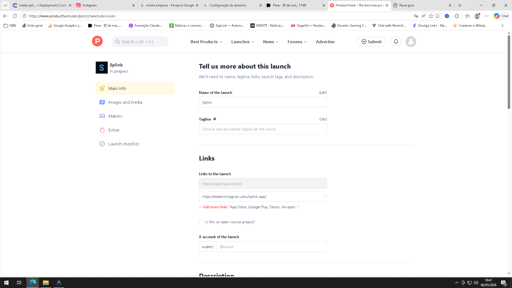

# 🛰️ ESTRATÉGIA DE AUTORIDADE SPLINK
## Guia de Backlinks e Indexação (Growth Hacking SEO)

Para que o Google coloque a Splink no topo, ele precisa ver que outros sites importantes estão falando de você. Siga este roteiro tático para cadastrar o site nos melhores lugares.

---

### 1. DIRETÓRIOS DE ELITE (Autoridade Máxima)
Estes sites dizem ao Google que a Splink é uma empresa real e de alta tecnologia.

*   **Product Hunt (producthunt.com):** O maior site de lançamentos de tecnologia.
*   **AlternativeTo (alternativeto.net):** Cadastre a Splink como alternativa ao "HubSpot", "Zendesk" ou "Chatbase".
*   **Indie Hackers (indiehackers.com):** Crie um perfil de "Product" para a Splink.

### 2. DIRETÓRIOS DE INTELIGÊNCIA ARTIFICIAL
Essenciais para indexar o seu site como uma ferramenta de IA.

*   **Futurepedia (futurepedia.io):** O maior diretório de IA.
*   **There's An AI For That (theresanaiforthat.com):** Muito importante para o nicho.
*   **Aifindy (aifindy.com.br):** Diretório brasileiro de ferramentas de IA.

### 3. PLATAFORMAS DE CONTEÚDO (Indexação em Minutos)
Use estas para "puxar" os robôs do Google para o seu site através de links em posts.

*   **Medium (medium.com):** Poste um artigo curto: "Como escalamos operações com o Protocolo Splink".
*   **Reddit (reddit.com):** Participe de comunidades como `r/startups` ou `r/vendas`.
*   **Quora (quora.com):** Responda perguntas sobre "Como automatizar o WhatsApp" e coloque o link da Splink.

---

### ✍️ COPY TÁTICA (Para usar nos cadastros)

**Título:** Splink - Hacking A.I Business
**Tagline:** Infraestrutura Tática de IA e Automação Massiva.

**Descrição Curta:**
Ecossistema completo para escala de operações comerciais através de Agentes de IA, Automação de WhatsApp e Extração Inteligente de Leads.

**Descrição Longa:**

---

### 🚀 PLANO DE AÇÃO:
1. Comece pelo **Product Hunt** hoje.
2. Cadastre a Splink no **Aifindy** (foco no Brasil).
3. Faça um post no **LinkedIn** marcando a URL: `https://splinkapp.com.br`.

**Status Técnica:** Site 100% pronto para receber esses links.
